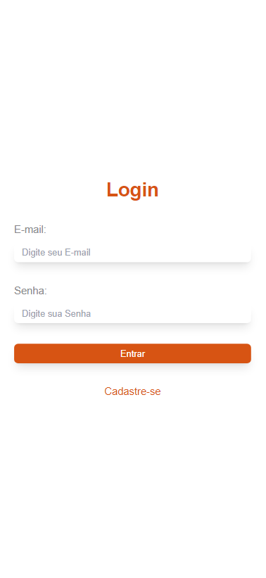

## Organiza.io

__Accessible project link: <a href="https://organiza-io.onrender.com/">Organiza.io</a>__

### What it is :

The project came about with the aim of facilitating my weekly organization, creating a schedule so that I could write down my actions, organizing them in a way that makes it easier to view. So that I could pass this idea forward, I created a registration system so that several people can use the same system, all while saving each person's data in the cloud, to access from anywhere, on different devices. This data can be expanded to each registered appointment, thus showing the complete description of each activity, as well as its possible deletion. To better adapt the appearance to each person's preference, I created a selection for a light or night theme.

> Program developed in my native language (Portuguese).

### Technologies and libraries used :
* HTML, CSS , JavaScript
* Node.js
* MongoDB
* Express
* handlebars
* mongoose
* bcrypt
* passport
* connect-flash
* express-session

> The code was completely commented, for easy understanding of how the entire program works. Furthermore, it is responsive to different screen sizes, making it possible to easily view it on different devices.

### Running the Application :

1. First, make sure you have <a href="https://nodejs.org/en">Node.js</a> installed on your machine.

    > Program developed in version 18.12.1 on Node

2. To run the project, you need go to the "db.js" file, located in the "config" folder, and replace the "temp" variable with your access link to the MongoDB database.

3. Then install the project <a href="./package.json">requirements</a> with the command in the terminal:
    ```bash
    npm install

    ```

4. Now, just run the <a href="app.js">main</a> file with the following command :
    ```bash
    node app.js

    ```
    
### Preview :

<table width="100%"> 
<tr>
<td width="50%">

</td> 
<td width="50%">

</td> 
<tr>
<td width="50%">

</td> 
<td width="50%">

</td> 
</table>
