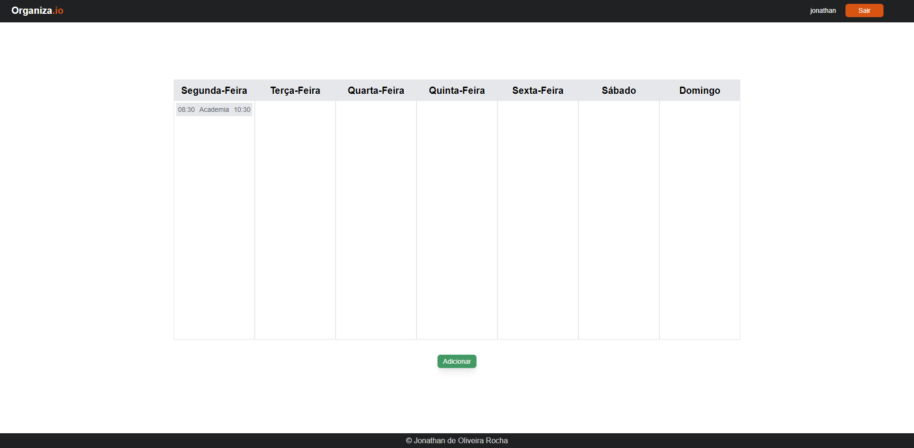

# Organiza.io

**Accessible project link: <a href="https://organiza-io.vercel.app/">Organiza.io</a>**

## Summary

1. [What it is](#what-it-is)
2. [Folders](#folders)
3. [Running the application locally](#running-the-application-locally)
4. [Preview](#preview)

## What it is

The project came about with the aim of facilitating my weekly organization, creating a schedule so that I could write down my actions, organizing them in a way that makes it easier to view. So that I could pass this idea forward, I created a registration system so that several people can use the same system, all while saving each person's data in the cloud, to access from anywhere, on different devices. This data can be expanded to each registered appointment, thus showing the complete description of each activity, as well as its possible deletion.

> Program developed in my native language (Portuguese).

### Technologies and libraries used :

- HTML, CSS , JavaScript
- React
- Tailwind CSS
- Node.js (Back-End)
- Expresss
- MongoDB

## Folders

### Backend :

- **/src/config:** Defines project settings
- **/src/controllers:** Defines the request handling functions
- **/src/helpers:** Defines recurring auxiliary functions the Database
- **/src/models:** Defines models for storage in the Database
- **/src/routes:** Defines API routes
- **/src/services:** Defines specific files for handling the Database

### Frontend :

- **/src/api:** Defines all the API calls
- **/src/assets:** Defines all image files used
- **/src/components:** Defines each fragmented part of the application

## Running the application locally

1. First, make sure you have <a href="https://nodejs.org/en">Node.js</a> installed on your machine.

   > Program developed in version 18.12.1 on Node.js

2. To run the project, you need go to the "db.js" file, located in the "config" folder, and replace the "temp" variable with your access link to the MongoDB database.

3. To run the project, you need to create a file called ".env" in the backend folder, paste the lines below into this file and replace the strings with their respective information:

   ```bash
    DATABASE_URI='<YOUR-MONGODB-DATABASE-URI>'
    SECRET_KEY="<SECRETE-CODE-TO-SESSION>"
   ```

4. Replace the application domain with the local address in the constant "BASE_URL", in the files in <a href="/frontend/src/api">/frontend/src/api</a>

    ```bash
    Before:
    const BASE_URL = "https://organiza-io-api.vercel.app/api/appointments";

    After:
    const BASE_URL = "http://localhost:8000/api/appointments";
    ```
5. Then run the “start.bat” file in the root directory.

## Preview

#### Desktop

<table width="100%"> 
<tr>
<td width="100%">
 
</td>
<tr>
</table>

<table width="100%"> 
<tr>
<td width="50%">
 
</td>
<td width="50%">
 
</td>
<tr>
</table>

#### Mobile

<table width="100%"> 
<tr>
<td width="33%">

</td> 
<td width="33%">

</td> 
<td width="33%">

</td>  
</tr>
</table>
